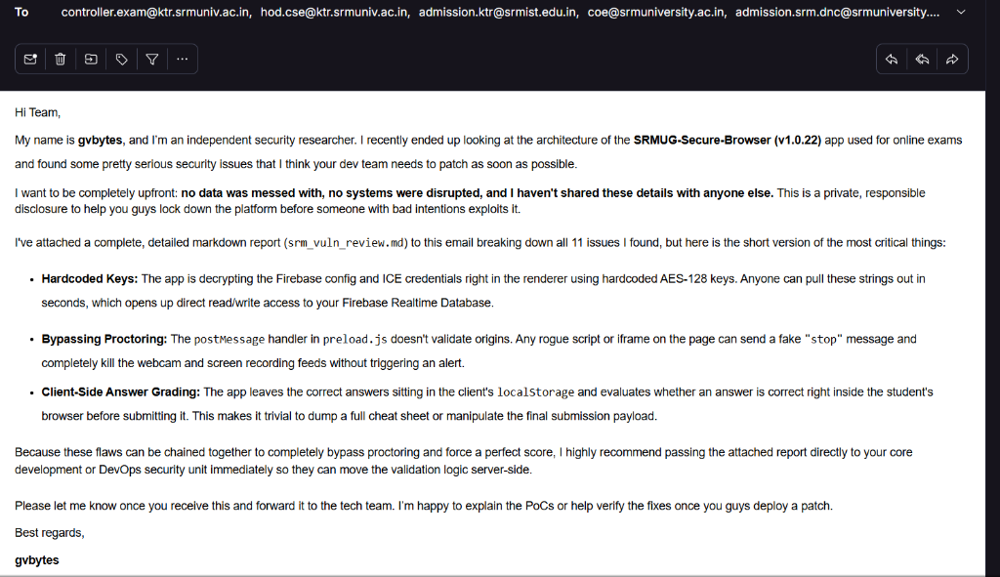

# SRM Secure Browser Security Review

I put this repo together after reviewing `SRMUG-Secure-Browser v1.0.22`, an Electron-based exam browser distributed by Eduswitch Solutions. The notes focus on design and implementation issues that affect exam integrity, proctoring reliability, and student privacy.

## Scope

The review is based on an extracted `app.asar` bundle. I looked at readable renderer and preload code, bundled JavaScript, native helper binaries, Firebase/WebRTC usage, and the visible client-side exam/proctoring flow.

The compiled `main.jsc` file was not fully decompiled, so the report calls out that limitation where main-process behavior could not be confirmed from source.

## Key Findings

The report tracks 13 issues across renderer trust boundaries, exposed configuration, IPC/message handling, exam-state design, Electron dependency age, and privacy-sensitive data collection.

Severity snapshot:

| Severity | Count | Main Themes |
|---|---:|---|
| Critical | 3 | Exposed client-side secrets, unauthenticated message control, answer-key exposure |
| High | 5 | Public privileged globals, weak DevTools lockdown, old Electron, client-writable Firebase state, leaked updater config |
| Medium | 4 | Weak VM checks, deprecated request library, GPS collection concerns, hardcoded storage endpoints |
| Low | 1 | Ineffective PrintScreen handling |

## Repository Contents

| File / Folder | Purpose |
|---|---|
| `SRM_Secure_Browser_Security_Review.md` | Full security vulnerability assessment report detailing Findings 1 through 13 with inline PoC code blocks |
| `README.md` | Repo overview, severity summary, and responsible disclosure logs |
| `poc/` | Functional Proof of Concept (PoC) scripts and binaries |

## Proof of Concept Scripts

Functional exploitation utilities demonstrating specific flaws are organized in the `poc/` directory:

- **`poc/bypass-poc.js`**: Dispatches a cross-document message payload (`msg: "stop"`) to the unvalidated preload listener to kill webcam and desktop streams.
- **`poc/extract-answers.js`**: Dumps the plaintext answer key from `localStorage` and mutates answer selection flags to force a 100% score payload on submission.
- **`poc/decrypt-config.js`**: Decrypts Firebase API keys and TURN/STUN ICE credentials using recovered static AES-128-ECB keys (`keysefghijkldesk`, `icesefghijklmnop`).
- **`poc/fake-vmdetect.cs`**: C# stub template for compiling a dummy executable that replaces `VMDetect.exe` in local program files and mocks an "all-clear" JSON response.

## Responsible Handling

The public version of this report intentionally avoids publishing live-looking keys or step-by-step exam bypass instructions. The goal is to document architectural weaknesses and help a maintainer, researcher, or reviewer understand what needs to be fixed without turning the write-up into an operational abuse guide.

If you are maintaining a similar Electron-based exam or kiosk application, treat the renderer as untrusted. Sensitive decisions should be enforced by the server or privileged main process, with strict validation at every boundary.

## Proof of Responsible Disclosure

Before making any of this public, I reached out to SRM directly. I emailed the report to multiple university contacts — controller of exams, the CSE HOD, admissions, the COE office, and the DNC team — explaining everything I found and offering to walk them through the PoCs or help verify fixes once they patched things.

As of today, I haven't received any response from them.

Here's a screenshot of that email for proof:

The email had the full vulnerability report (`srm_vuln_review.md`) attached, covering all 11 issues. No data was accessed, no systems were disrupted, and the findings were not shared with anyone else before this disclosure attempt.

## Recommended Fix Order

1. Move answer keys and grading logic fully server-side.
2. Remove hardcoded secrets from renderer code and rotate exposed credentials.
3. Replace AES-ECB usage with modern authenticated encryption where encryption is actually needed.
4. Validate `postMessage` origins, schemas, and allowed actions.
5. Remove public privileged globals such as test start/stop controls from the page context.
6. Lock Firebase rules to per-student/per-session permissions and validate writes server-side.
7. Upgrade Electron and remove deprecated `remote` usage.
8. Rework privacy-sensitive flows such as geolocation collection with explicit consent and retention rules.

